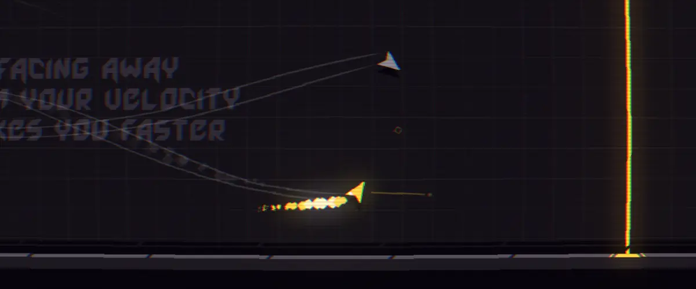

<h1>DRFT</h1>

 
DRFT is all about fast, risky plays, and learning the limitations of your vehicle as you drift, boost, blink, and skate around minimalist environments rendered with clean and stylish pixel art.

As a game with a very simple core loop (you move faster when you're drifting), it gave me an opportunity to focus on realising tight UX and UI within Godot, and tying it into more rich features like Steam leaderboards integration, ghost support, and level design tools!


../../assets/images/drft/demo1.webp
../../assets/images/drft/1.webp
../../assets/images/drft/2.webp
../../assets/images/drft/3.webp


